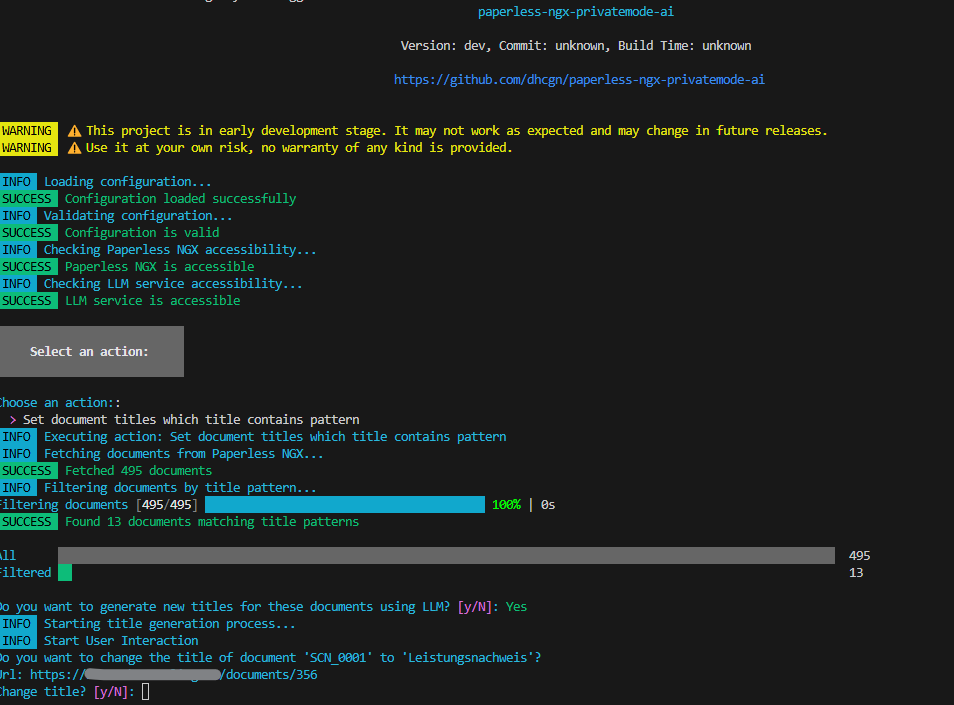
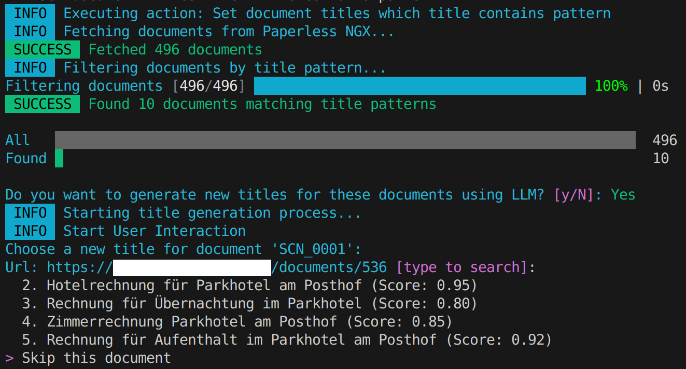

[](https://github.com/dhcgn/paperless-ngx-privatemode-ai/actions/workflows/build_and_test.yml)

⚠️ This project is in early development stage. It may not work as expected and may change in future releases.
⚠️ Use it at your own risk, no warranty of any kind is provided.

This project is for demonstration purposes only. It is not affiliated with or endorsed by Paperless NGX or Privatemode.ai.

# paperless-ngx-privatemode-ai

Help with documents in [Paperless NGX](https://docs.paperless-ngx.com/) with confidential LLM by [Privatemode.ai](https://privatemode.ai) (docs https://docs.privatemode.ai/).

## Motivation

Managing documents with [Paperless NGX](https://docs.paperless-ngx.com/) is powerful, but I wanted to enhance privacy and automation by integrating a confidential LLM. My goal is to automatically generate accurate titles and content for documents—without exposing sensitive data to public LLM providers like OpenAI or Google.

While Paperless NGX uses OCRmyPDF with Tesseract for text extraction, its results are sometimes imperfect. Leveraging a private LLM allows for improved title suggestions and content extraction, all within a secure environment.

If this approach proves valuable for myself, I plan to expand the tool to support automatic tagging and additional metadata.

## GUI

### Main Menu
The application starts with an interactive menu where you can choose different actions:



### Title Selection Dialog
When generating titles, the LLM provides multiple suggestions and you can interactively select the best one:



## Prerequisites

This tool requires two systems to be available:

1. **Paperless-NGX** - Document management system
2. **Privatemode-Proxy** - Confidential LLM proxy

### Running Privatemode-Proxy

You can easily run Privatemode-Proxy using Docker:

```bash
docker run -p 8080:8080 --rm ghcr.io/edgelesssys/privatemode/privatemode-proxy:latest --apiKey $PRIVATE_MODE_API_KEY
```

To obtain an API key, visit: https://www.privatemode.ai/api

## Run

```cmd
paperless-ngx-privatemode-ai.exe --config config.yaml
```

### Config

See [config.sample.yaml](config.sample.yaml) for example configuration.

You need to install ImageMagick on your system. On Windows, set the path in the configuration file under `tools.imagemagick-for-windows.fullpath`. On Linux, ensure ImageMagick is installed system-wide (it will be detected automatically).
I'm not happy with this solution, but it works for now. I was not able to find a native Go library to convert PDF to images.

### Dialog

```cmd
Choose an action: [type to search]: 
  Set titles from documents with pattern: '^SCN_.*$, .*BRN.*$'
  Set content with OCR from documents with pattern: '^$'
> Exit
```

### Program flow

1. Load configuration from argument `--config`
2. Check configuration
3. Check if `paperless-ngx` is accessible
4. Check if `privatemode.ai` is accessible and models are available
5. Ask user for action
6. Execute action and show progress


## More Use Cases with Privatemode.ai

Go to my collection of ai scripts: https://github.com/dhcgn/ai-sample-scripts
